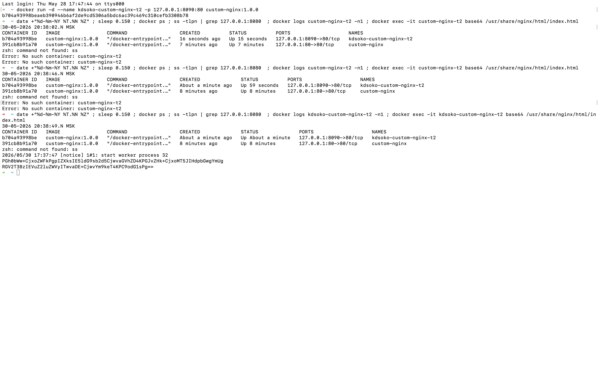
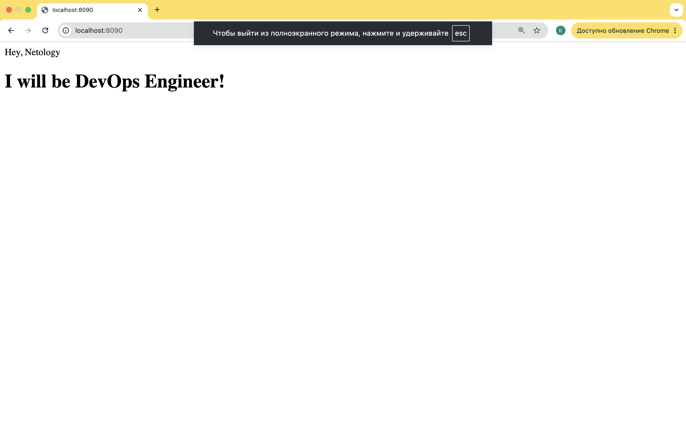
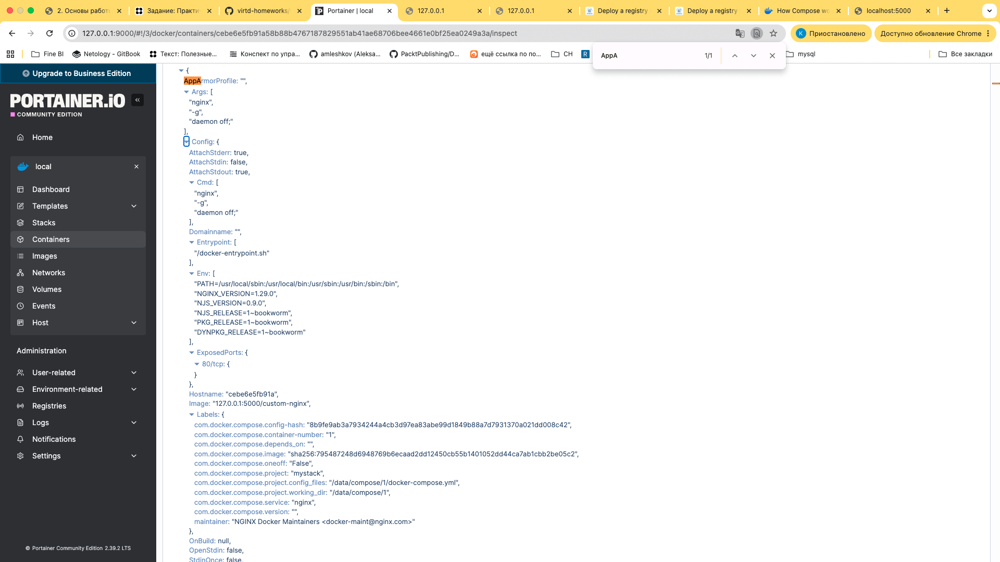

# Домашнее задание к занятию 4 «Оркестрация группой Docker контейнеров на примере Docker Compose»

### Инструкция к выполению

1. Для выполнения заданий обязательно ознакомьтесь с [инструкцией](https://github.com/netology-code/devops-materials/blob/master/cloudwork.MD) по экономии облачных ресурсов. Это нужно, чтобы не расходовать средства, полученные в результате использования промокода.
2. Практические задачи выполняйте на личной рабочей станции или созданной вами ранее ВМ в облаке.
3. Своё решение к задачам оформите в вашем GitHub репозитории в формате markdown!!!
4. В личном кабинете отправьте на проверку ссылку на .md-файл в вашем репозитории.

## Задача 1

Сценарий выполнения задачи:
- Установите docker и docker compose plugin на свою linux рабочую станцию или ВМ.
- Если dockerhub недоступен создайте файл /etc/docker/daemon.json с содержимым: ```{"registry-mirrors": ["https://mirror.gcr.io", "https://daocloud.io", "https://c.163.com/", "https://registry.docker-cn.com"]}```
- Зарегистрируйтесь и создайте публичный репозиторий  с именем "custom-nginx" на https://hub.docker.com (ТОЛЬКО ЕСЛИ У ВАС ЕСТЬ ДОСТУП);
- скачайте образ nginx:1.29.0;
- Создайте Dockerfile и реализуйте в нем замену дефолтной индекс-страницы(/usr/share/nginx/html/index.html), на файл index.html с содержимым:
```
<html>
<head>
Hey, Netology
</head>
<body>
<h1>I will be DevOps Engineer!</h1>
</body>
</html>
```
- Соберите и отправьте созданный образ в свой dockerhub-репозитории c tag 1.0.0 (ТОЛЬКО ЕСЛИ ЕСТЬ ДОСТУП). 
- Предоставьте ответ в виде ссылки на https://hub.docker.com/<username_repo>/custom-nginx/general .

### Решение

```bash
cd task01
docker build -t custom-nginx:1.0.0 .
docker run -d --name custom-nginx -p 127.0.0.1:80:80 custom-nginx:1.0.0
curl http://127.0.0.1:80
```

Ссылка на мой [докерхаб](https://hub.docker.com/repository/docker/sokkos/custom-nginx/general)

## Задача 2
1. Запустите ваш образ custom-nginx:1.0.0 командой docker run в соответвии с требованиями:
- имя контейнера "ФИО-custom-nginx-t2"
- контейнер работает в фоне
- контейнер опубликован на порту хост системы 127.0.0.1:8080
2. Не удаляя, переименуйте контейнер в "custom-nginx-t2"
3. Выполните команду ```date +"%d-%m-%Y %T.%N %Z" ; sleep 0.150 ; docker ps ; ss -tlpn | grep 127.0.0.1:8080  ; docker logs custom-nginx-t2 -n1 ; docker exec -it custom-nginx-t2 base64 /usr/share/nginx/html/index.html```
4. Убедитесь с помощью curl или веб браузера, что индекс-страница доступна.

В качестве ответа приложите скриншоты консоли, где видно все введенные команды и их вывод.

```bash
docker run -d --name kdsoko-custom-nginx-t2 -p 127.0.0.1:8090:80 custom-nginx:1.0.0

date +"%d-%m-%Y %T.%N %Z" ; sleep 0.150 ; docker ps ; ss -tlpn | grep 127.0.0.1:8080  ; docker logs kdsoko-custom-nginx-t2 -n1 ; docker exec -it kdsoko-custom-nginx-t2 base64 /usr/share/nginx/html/index.html
```

Скрин команд 



Скрин браузера




## Задача 3
1. Воспользуйтесь docker help или google, чтобы узнать как подключиться к стандартному потоку ввода/вывода/ошибок контейнера "custom-nginx-t2".
2. Подключитесь к контейнеру и нажмите комбинацию Ctrl-C.
3. Выполните ```docker ps -a``` и объясните своими словами почему контейнер остановился.
4. Перезапустите контейнер
5. Зайдите в интерактивный терминал контейнера "custom-nginx-t2" с оболочкой bash.
6. Установите любимый текстовый редактор(vim, nano итд) с помощью apt-get.
7. Отредактируйте файл "/etc/nginx/conf.d/default.conf", заменив порт "listen 80" на "listen 81".
8. Запомните(!) и выполните команду ```nginx -s reload```, а затем внутри контейнера ```curl http://127.0.0.1:80 ; curl http://127.0.0.1:81```.
9. Выйдите из контейнера, набрав в консоли  ```exit``` или Ctrl-D.
10. Проверьте вывод команд: ```ss -tlpn | grep 127.0.0.1:8080``` , ```docker port custom-nginx-t2```, ```curl http://127.0.0.1:8080```. Кратко объясните суть возникшей проблемы.
11. * Это дополнительное, необязательное задание. Попробуйте самостоятельно исправить конфигурацию контейнера, используя доступные источники в интернете. Не изменяйте конфигурацию nginx и не удаляйте контейнер. Останавливать контейнер можно. [пример источника](https://www.baeldung.com/linux/assign-port-docker-container)
12. Удалите запущенный контейнер "custom-nginx-t2", не останавливая его.(воспользуйтесь --help или google)

В качестве ответа приложите скриншоты консоли, где видно все введенные команды и их вывод.

### Решение

```
➜  ~ docker attach custom-nginx-t2
Error: No such container: custom-nginx-t2
➜  ~ docker attach kdsoko-custom-nginx-t2
172.17.0.1 - - [30/May/2026:17:42:34 +0000] "GET / HTTP/1.1" 200 94 "-" "Mozilla/5.0 (Macintosh; Intel Mac OS X 10_15_7) AppleWebKit/537.36 (KHTML, like Gecko) Chrome/148.0.0.0 Safari/537.36" "-"
172.17.0.1 - - [30/May/2026:17:42:34 +0000] "GET /favicon.ico HTTP/1.1" 404 555 "http://127.0.0.1:8090/" "Mozilla/5.0 (Macintosh; Intel Mac OS X 10_15_7) AppleWebKit/537.36 (KHTML, like Gecko) Chrome/148.0.0.0 Safari/537.36" "-"
2026/05/30 17:42:34 [error] 32#32: *4 open() "/usr/share/nginx/html/favicon.ico" failed (2: No such file or directory), client: 172.17.0.1, server: localhost, request: "GET /favicon.ico HTTP/1.1", host: "127.0.0.1:8090", referrer: "http://127.0.0.1:8090/"
172.17.0.1 - - [30/May/2026:17:42:38 +0000] "GET / HTTP/1.1" 304 0 "-" "Mozilla/5.0 (Macintosh; Intel Mac OS X 10_15_7) AppleWebKit/537.36 (KHTML, like Gecko) Chrome/148.0.0.0 Safari/537.36" "-"
^C2026/05/30 17:42:41 [notice] 1#1: signal 2 (SIGINT) received, exiting
2026/05/30 17:42:41 [notice] 31#31: exiting
2026/05/30 17:42:41 [notice] 31#31: exit
2026/05/30 17:42:41 [notice] 29#29: exiting
2026/05/30 17:42:41 [notice] 29#29: exit
2026/05/30 17:42:41 [notice] 30#30: exiting
2026/05/30 17:42:41 [notice] 30#30: exit
2026/05/30 17:42:41 [notice] 32#32: exiting
2026/05/30 17:42:41 [notice] 32#32: exit
2026/05/30 17:42:41 [notice] 1#1: signal 17 (SIGCHLD) received from 30
2026/05/30 17:42:41 [notice] 1#1: worker process 30 exited with code 0
2026/05/30 17:42:41 [notice] 1#1: signal 29 (SIGIO) received
2026/05/30 17:42:41 [notice] 1#1: signal 17 (SIGCHLD) received from 32
2026/05/30 17:42:41 [notice] 1#1: worker process 32 exited with code 0
2026/05/30 17:42:41 [notice] 1#1: signal 29 (SIGIO) received
2026/05/30 17:42:41 [notice] 1#1: signal 17 (SIGCHLD) received from 31
2026/05/30 17:42:41 [notice] 1#1: worker process 31 exited with code 0
2026/05/30 17:42:41 [notice] 1#1: signal 29 (SIGIO) received
2026/05/30 17:42:41 [notice] 1#1: signal 17 (SIGCHLD) received from 29
2026/05/30 17:42:41 [notice] 1#1: worker process 29 exited with code 0
2026/05/30 17:42:41 [notice] 1#1: exit

```

## Задача 4


- Запустите первый контейнер из образа ***centos*** c любым тегом в фоновом режиме, подключив папку  текущий рабочий каталог ```$(pwd)``` на хостовой машине в ```/data``` контейнера, используя ключ -v.
- Запустите второй контейнер из образа ***debian*** в фоновом режиме, подключив текущий рабочий каталог ```$(pwd)``` в ```/data``` контейнера. 
- Подключитесь к первому контейнеру с помощью ```docker exec``` и создайте текстовый файл любого содержания в ```/data```.
- Добавьте ещё один файл в текущий каталог ```$(pwd)``` на хостовой машине.
- Подключитесь во второй контейнер и отобразите листинг и содержание файлов в ```/data``` контейнера.


В качестве ответа приложите скриншоты консоли, где видно все введенные команды и их вывод.


## Задача 5

1. Создайте отдельную директорию(например /tmp/netology/docker/task5) и 2 файла внутри него.
"compose.yaml" с содержимым:
```
version: "3"
services:
  portainer:
    network_mode: host
    image: portainer/portainer-ce:latest
    volumes:
      - /var/run/docker.sock:/var/run/docker.sock
```
"docker-compose.yaml" с содержимым:
```
version: "3"
services:
  registry:
    image: registry:2

    ports:
    - "5000:5000"
```

И выполните команду "docker compose up -d". Какой из файлов был запущен и почему? (подсказка: https://docs.docker.com/compose/compose-application-model/#the-compose-file )

Будет запущен compose.yaml

> The default path for a Compose file is compose.yaml (preferred) or compose.yml that is placed in the working directory. Compose also supports docker-compose.yaml and docker-compose.yml for backwards compatibility of earlier versions. If both files exist, Compose prefers the canonical compose.yaml.


2. Отредактируйте файл compose.yaml так, чтобы были запущенны оба файла. (подсказка: https://docs.docker.com/compose/compose-file/14-include/)

Добавил следующий блок

```yaml
include:
  - docker-compose.yaml 
```
Проверка
```bash
docker compose up -d
WARN[0000] Found multiple config files with supported names: /Users/konstantinsokolov/dev/projects/pet_projects/devops/01_virtualization/hw/hw_02/my_hw/task05/compose.yaml, /Users/konstantinsokolov/dev/projects/pet_projects/devops/01_virtualization/hw/hw_02/my_hw/task05/docker-compose.yaml 
WARN[0000] Using /Users/konstantinsokolov/dev/projects/pet_projects/devops/01_virtualization/hw/hw_02/my_hw/task05/compose.yaml 
WARN[0000] /Users/konstantinsokolov/dev/projects/pet_projects/devops/01_virtualization/hw/hw_02/my_hw/task05/docker-compose.yaml: `version` is obsolete 
WARN[0000] /Users/konstantinsokolov/dev/projects/pet_projects/devops/01_virtualization/hw/hw_02/my_hw/task05/compose.yaml: `version` is obsolete 
[+] Running 3/3
 ✔ Network task05_default        Created                                                                                             0.0s 
 ✔ Container task05-portainer-1  Started                                                                                             0.2s 
 ✔ Container task05-registry-1   Started                                                                                             0.7s
```

3. Выполните в консоли вашей хостовой ОС необходимые команды чтобы залить образ custom-nginx как custom-nginx:latest в запущенное вами, локальное registry. Дополнительная документация: https://distribution.github.io/distribution/about/deploying/

```bash
docker tag sokkos/custom-nginx:1.0.0 127.0.0.1:5000/custom-nginx:latest
docker push 127.0.0.1:5000/custom-nginx:latest

# проверим
curl http://127.0.0.1:5000/v2/custom-nginx/tags/list | jq
  % Total    % Received % Xferd  Average Speed   Time    Time  Time  Current
                                 Dload  Upload   Total   Spent  Left  Speed
  0     0    0     0    0     0      0      0 --:--:-- --:--:--100    42  100    42    0     0   5827      0 --:--:-- --:--:----:--:--  6000
{
  "name": "custom-nginx",
  "tags": [
    "latest"
  ]
}
```

4. Откройте страницу "https://127.0.0.1:9000" и произведите начальную настройку portainer.(логин и пароль адмнистратора)

У меня мак, так что пришлось чуть поменять компоуз
```yaml
```
services:
  portainer:
    # network_mode: host
    image: portainer/portainer-ce:latest
    ports:
      - "9000:9000"
      - "9443:9443"    
    volumes:
      - /var/run/docker.sock:/var/run/docker.sock
```
```

5. Откройте страницу "http://127.0.0.1:9000/#!/home", выберите ваше local  окружение. Перейдите на вкладку "stacks" и в "web editor" задеплойте следующий компоуз:

```
version: '3'

services:
  nginx:
    image: 127.0.0.1:5000/custom-nginx
    ports:
      - "9090:80"
```
6. Перейдите на страницу "http://127.0.0.1:9000/#!/2/docker/containers", выберите контейнер с nginx и нажмите на кнопку "inspect". В представлении <> Tree разверните поле "Config" и сделайте скриншот от поля "AppArmorProfile" до "Driver".



7. Удалите любой из манифестов компоуза(например compose.yaml).  Выполните команду "docker compose up -d". Прочитайте warning, объясните суть предупреждения и выполните предложенное действие. Погасите compose-проект ОДНОЙ(обязательно!!) командой.

В качестве ответа приложите скриншоты консоли, где видно все введенные команды и их вывод, файл compose.yaml , скриншот portainer c задеплоенным компоузом.

---

### Правила приема

Домашнее задание выполните в файле readme.md в GitHub-репозитории. В личном кабинете отправьте на проверку ссылку на .md-файл в вашем репозитории.

